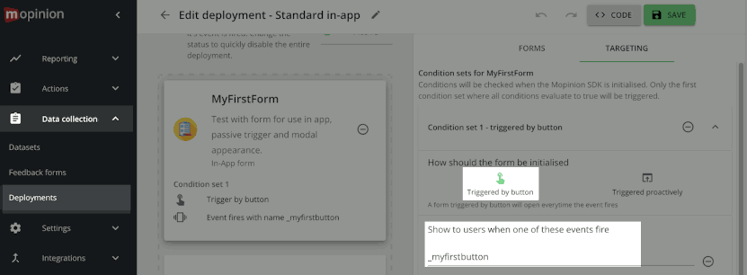

# Mopinion Mobile SDK for android
The Mopinion Mobile SDK can be used to collect feedback from Android apps based on events.
To use Mopinion mobile feedback forms in your app you can include the SDK as a Library in your Android Studio project.

There is also a Mopinion Mobile SDK for iOS available [here](https://github.com/mopinion/mopinion-sdk-ios).

### Contents

- Release notes
- [Installation](#install)
- [Implement the SDK](#implement)
- [Submitting extra data](#extra-data)
- [Using callback mode](#callback-mode)
- [Edit triggers](#edit-triggers)

## Release notes for version 0.6.0

### New features
- users can select an image from their device to upload as a screenshot, or use the pre-made screenshot.
- This new image select feature is optional and can be enabled per form in the Mopinion Form editor. By default the SDK will behave as before and will only show the pre-made screenshot.

### Improvements
- sdk uses react-native autolink feature, removed the need to manually specify some dependencies.

### Other changes
- minSdkVersion raised from 19 to 21.

<br>

## <a name="install">install</a>

The Mopinion Mobile SDK Library can be installed by adding it `build.gradle` file of your project.
The SDK is partly built with [React Native](https://facebook.github.io/react-native/), it needs the React Native Library to function.

You can see how your mobile forms will look like in your app by downloading our [Mopinion Forms](https://play.google.com/store/apps/details?id=com.mopinion.news) preview app in the Google Play Store.

### Create a Github personal access token
You'll need this instead of a password. Create a github personal access token if you don't have one yet, using [their instructions](https://docs.github.com/en/github/authenticating-to-github/creating-a-personal-access-token). You'll need to request [read:packages permissions](https://docs.github.com/en/packages/learn-github-packages/about-permissions-for-github-packages#about-scopes-and-permissions-for-package-registries) to access the SDK.

Put your user name and PAT in environment variables:

```
$ setenv GITHUBPKG_USERNAME yourgithubusername
$ setenv GITHUBPKG_APITOKEN yourgithubpat
```

### Prepare folder structure

If you have a default Android Studio folder structure for your project, then move all your files from the folder containing the `app` folder into a new folder `android`:

```
$ cd your-project
$ mkdir android
$ mv app android/app
$ mv build.gradle settings.gradle android/
$ # etc.
```

### npm

[Install Node.js/npm](https://www.npmjs.com/get-npm)

make a `package.json` file in the root of your project:

```javascript
{
  "name": "YourAppNameHere",
  "version": "0.1.0",
  "dependencies": {
    "@react-native-async-storage/async-storage": "^1.15.14",
    "create-react-class": "^15.7.0",
    "react": "17.0.2",
    "react-native": "0.66.3",
    "react-native-image-picker": "^3.8.1",
    "react-native-webview": "^11.15.0"
  }
}
```

`$ npm install`

Your project folder should now at least contain the following:

```
./android/app/
./node_modules/
./package.json
```

### dependencies

- [Google Volley](https://github.com/google/volley), installation is already included in our instructions here for app/build.gradle.

### Android Studio

In the main project `android/build.gradle` file, add the following, minSdkVersion should be at least 21:

```gradle
buildscript {
    ext {
        buildToolsVersion = "30.0.2"
        minSdkVersion = 21
        compileSdkVersion = 30
        targetSdkVersion = 30
        ndkVersion = "21.4.7075529"
    }
    repositories {
        google()
        mavenCentral()
    }
    dependencies {
        classpath("com.android.tools.build:gradle:4.2.2")
    }
}

plugins {
    id 'maven'
}

allprojects {
    repositories {
        mavenCentral()
        mavenLocal()
        maven {
            // All of React Native (JS, Android binaries) is installed from npm
            url "$rootDir/../node_modules/react-native/android"
        }
        maven {
            // Android JSC is installed from npm
            url("$rootDir/../node_modules/jsc-android/dist")
        }
        google()
        maven { url 'https://www.jitpack.io' }
        maven {
            url 'https://maven.pkg.github.com/mopinion/mopinion-sdk-android'
            credentials {
                username = GITHUBPKG_USERNAME
                password = GITHUBPKG_APITOKEN
            }
        }
    }
}
```

The `urls "$rootDir/../node_modules/*"` assumes the folder `node_modules` is in the folder above your app folder.

#### android/app/build.gradle

In the `build.gradle` file of your main component, set the `minSdkVersion` to `21` and add the React Native and Mopinion SDK Libraries :

```gradle
apply plugin: "com.android.application"

import com.android.build.OutputFile

...
project.ext.react = [
    enableHermes: false,  // clean and rebuild if changing
]

apply from: "../../node_modules/react-native/react.gradle"

def enableSeparateBuildPerCPUArchitecture = false
def enableProguardInReleaseBuilds = false
def jscFlavor = 'org.webkit:android-jsc:+'
def enableHermes = project.ext.react.get("enableHermes", false);
def nativeArchitectures = project.getProperties().get("reactNativeDebugArchitectures")

...
android {
    ndkVersion rootProject.ext.ndkVersion
    compileSdkVersion rootProject.ext.compileSdkVersion
	...
	defaultConfig {
		...
        minSdkVersion rootProject.ext.minSdkVersion
        targetSdkVersion rootProject.ext.targetSdkVersion
		...
	}
    splits {
        abi {
            reset()
            enable enableSeparateBuildPerCPUArchitecture
            universalApk false  // If true, also generate a universal APK
            include "armeabi-v7a", "x86", "arm64-v8a", "x86_64"
        }
    }
    buildTypes {
        debug {
            if (nativeArchitectures) {
                ndk {
                    abiFilters nativeArchitectures.split(',')
                }
            }
        }
    }
    
    // applicationVariants are e.g. debug, release
    applicationVariants.all { variant ->
        variant.outputs.each { output ->
            // For each separate APK per architecture, set a unique version code as described here:
            // https://developer.android.com/studio/build/configure-apk-splits.html
            // Example: versionCode 1 will generate 1001 for armeabi-v7a, 1002 for x86, etc.
            def versionCodes = ["armeabi-v7a": 1, "x86": 2, "arm64-v8a": 3, "x86_64": 4]
            def abi = output.getFilter(OutputFile.ABI)
            if (abi != null) {  // null for the universal-debug, universal-release variants
                output.versionCodeOverride =
                        defaultConfig.versionCode * 1000 + versionCodes.get(abi)
            }

        }
    }
	...
	
}
...
dependencies {
    implementation "com.facebook.react:react-native:0.66.3"  // From node_modules
    implementation "androidx.swiperefreshlayout:swiperefreshlayout:1.1.0"
    implementation "com.android.volley:volley:1.2.1"

    ...
    implementation "com.mopinion.mopinionsdk:mopinionsdk:0.6.0"
    ...

    if (enableHermes) {
        def hermesPath = "../../node_modules/hermes-engine/android/";
        debugImplementation files(hermesPath + "hermes-debug.aar")
        releaseImplementation files(hermesPath + "hermes-release.aar")
    } else {
        implementation jscFlavor
    }
}
...

apply from: file("../../node_modules/@react-native-community/cli-platform-android/native_modules.gradle"); applyNativeModulesAppBuildGradle(project)
```

#### android/settings.gradle

In the `settings.gradle` file of your main component, below the `rootProject.name` line, add the required React Native Projects:

```gradle
rootProject.name = "My Application"
...
apply from: file("../node_modules/@react-native-community/cli-platform-android/native_modules.gradle"); applyNativeModulesSettingsGradle(settings)
include ':app'
```

Again, the above assumes the `node_modules/` folder is in the folder above your app folder. 

#### android/app/src/main/AndroidManifest.xml

The SDK needs to connect to the Mopinion servers, so add the internet permission to your `AndroidManifest.xml`:

```xml
<?xml version="1.0" encoding="utf-8"?>
<manifest xmlns:android="http://schemas.android.com/apk/res/android"
    package="com.example.app">
    
		<uses-permission android:name="android.permission.INTERNET" />
		
		<application
		...
```

<br>

### <a name="implement">Implement the SDK</a>
For instance, in your MainActivity.java:

```java
Mopinion M = new Mopinion(Context context, String key, boolean log);
M.event(String event);
```

* The `context` is the Activity context from which you would like to activate the feedback form, normally `this`.
* The `key` should be replaced with your specific deployment key. This key can be found in your Mopinion account at the `Feedback forms` section under `Deployments`.
* The `log` flag can be set to `true` while developing the app to see Logcat messages in Android Studio from the Mopinion SDK library. (The default is `false` if not supplied.)
* The `event` is a specific event that can be connected to a feedback form action in the Mopinion system.  
* The default `_button` event triggers the form, but an unlimited number of custom events can also be added.

### example:
```java
Mopinion M = new Mopinion(this, "12345abcde");
M.event("_button");
```

Note that the event call is asynchronous.

<br>

## <a name="extra-data">extra data</a>

From version `0.3.0` it's also possible to send extra data from the app to your form. 
To do this, supply a key and a value to the `data()` method.
Add the data before calling the `event()` method if you want to include the data in the form that comes up for that event.

```java
M.data(String key, String value);
```

### Example:

```java
import com.mopinion.mopinionsdk.*;
...
Mopinion M = new Mopinion(this, "12345abcde");
...
M.data("first name", "Andy");
M.data("last name", "Rubin");
...
M.event("_button");
```

## clear extra data

From version `0.3.3` it's possible to remove all or a single key-value pair from the extra data previously supplied with the `data(key,value)` method. To remove a single key-value pair use this method:

```java
M.removeData(String key)
```

### Example:

```java
M.removeData("first name")
```

To remove all supplied extra data use this method without arguments:

```java
M.removeData()
```

Example:

```java
M.removeData()
```

<br>

## <a name="callback-mode">Using callback mode</a>
By default the SDK manages the feedback form autonomously without further involving your app. 
Version 0.5.0 introduced asynchronous callbacks to inform your code of certain actions (MopinionEvent). 

Provide a callback handler to receive a response, containing either data or optional error information. 


### Procedure overview

1. Call the `event()` method and pass it a callback function that implements the `MopinionEventListener.onMopinionEvent` interface.
2. In your callback function `onMopinionEvent()`, check the kind of `mopinionEvent` and optionally call `didSucceed()` or `hasErrors()` on the `response` to check for errors.
3. Optionally, call `hasData()` on the `response` object to check if there is data.
4. Depending on the kind of `mopinionEvent`, check for the presence of data specified by a `ResponseDataKey` using the call `hasData(ResponseDataKey)` on the `response`.
5. To get the data, call `getString(ResponseDataKey)` respectively `getJSONObject(ResponseDataKey)` on the `response`, depending on the type of data to retrieve.

You can also provide an optional error-callback handler to `event()` to seperately receive responses with error information. In that case the primary handler only receives responses without errors.

<br>

### Callback variants of the `event()` method
Triggers an event you defined in your deployment to open a form and receive MopinionEvent callbacks. If you don't specify a failHandler, the callback handler will also receive error responses.


```java
void event(String event, MopinionEventListener callbackHandler)
void event(String event, MopinionEventListener callbackHandler, MopinionEventErrorListener failHandler)
```

Parameters:

* `event`: The name of the event as definied in the deployment. For instance "_button".
* `callbackHandler`: The method implementing the `MopinionEventListener` interface to handle the `onMopinionEvent()` callback.
* `failHandler`: The method implementing the `MopinionEventErrorListener` interface to handle the `onMopinionEventError()` callback for MopinionEvents that resulted in errors.

<br>

### Callback methods `onMopinionEvent()` and `onMopinionEventError()`

These methods you implement in your code to receive MopinionEvents. They have the same parameters to pass you a response with optional additional information. 
What information is provided depends on the type of `MopinionEvent` and its origin.

```java
void onMopinionEvent(MopinionEvent mopinionEvent, MopinionResponse response)
void onMopinionEventError(MopinionEvent mopinionEvent, MopinionResponse response)
```

Parameters:

* `mopinionEvent`: The kind of response event that you receive from the SDK. Currently one of the following:
	* `FORM_OPEN` : when the form is shown
	* `FORM_SENT` : when the user has submitted the form
	* `FORM_CLOSED` : when the form has closed

* `response`: The MopinionResponse object containing additional information on the MopinionEvent. The response is never `null`, but use its `hasData()` methods to check if it contains any additional data, or `hasErrors()` for errors.

<br>

### MopinionResponse object
The data collection present in this object depends on the kind of MopinionEvent and its origin. The data is a key-value collection. Both data and errors can be missing. The response object contains methods to inspect and retrieve them. 


#### Getting data with `response.get()` and `response.hasData()`
Check with `hasData(key)` first, as the `get<>(key)` methods can return `null`. Pass a standard `ResponseDataKey` to these methods for the data you're interested in.

ResponseDataKey|Method to read it|Description
---|---|---
DATA_JSONOBJECT|.getJSONObject()|'raw' JSONObject with all available data
FORM_KEY|.getString()|the internal unique identifier for the form
FORM_NAME|.getString()|the name of the form. Distinct from the title of the form.

<br>

#### MopinionEvents and provided data in `response`
This is the data that can be present for a certain MopinionEvent:

MopinionEvent|ResponseDataKeys|Remarks
---|---|---
FORM_OPEN|DATA_JSONOBJECT|
&nbsp;|FORM_KEY|
&nbsp;|FORM_NAME|
FORM_SENT|DATA_JSONOBJECT|
&nbsp;|FORM_KEY|
&nbsp;|FORM_NAME|
FORM_CLOSED|DATA_JSONOBJECT|Currently only automatically closed forms provide data 
&nbsp;|FORM_KEY|only when autoclosed
&nbsp;|FORM_NAME|only when autoclosed

The order in which MopinionEvents occur is:

	1. FORM_OPEN
	2. FORM_SENT (only if the user submits a form)
	3. FORM_CLOSED

<br>

#### Reading `response` errors
Call `response.hasErrors()` on, followed by `response.getErrorString()` to get the error as text.
The `getErrorString()` method might return `null`.

<br>

### Callback handler example
Pseudo code to show the usage of the `event()` callback using the involved objects.

```java
...
Mopinion M = new Mopinion(this, yourdeploymentkey);
...
// open the form and wait for the events to appear
M.event(event, new MopinionEventListener() {
	@Override
	public void onMopinionEvent(MopinionEvent mopinionEvent, MopinionResponse response) {
		switch(mopinionEvent) {
			case FORM_OPEN:
				Log.d("CallbackDemo","a form opened, form key = " + response.getString(ResponseDataKey.FORM_KEY));
				break;
			case FORM_SENT:
				try {
					JSONObject jsonData = response.getJSONObject(ResponseDataKey.DATA_JSONOBJECT);
					Log.d("CallbackDemo","User submitted the form, raw data object=" + jsonData.toString());
				} catch (JSONException e) {
					// something wrong with the json data
					e.printStackTrace();
				}
				break;
			case FORM_CLOSED:
				if(response.hasData(ResponseDataKey.FORM_NAME)) {
					Log.d("CallbackDemo", "The form '" + response.getString(ResponseDataKey.FORM_NAME) + "' closed");
				} else {
					Log.d("CallbackDemo", "The form closed, no name was given.");
				}
				break;
			default:
				 Log.d("CallbackDemo","Ignoring this event.");
		}
	}
}, 
// dedicated error handler
new MopinionEventErrorListener() {
	@Override
	public void onMopinionEventError(MopinionEvent mopinionEvent, MopinionResponse response) {
		if( response.hasErrors() ) {
			Log.d("CallbackDemo","Event " + mopinionEvent.name() + " encountered an error:" + response.getErrorString());
		}
	}
);

```

<br>

## <a name="edit-triggers">Edit triggers</a>
In the Mopinion deployment editor you can define event names and triggers that will work with the SDK event names that you used in your app.
Login to your Mopinion account and go to Data collection, Deployments to use this functionality.



The custom defined events can be used in combination with rules/conditions:

* trigger: `passive` or `proactive`. A passive form always shows when the event is triggered. A proactive form only shows once, you can set the refresh time after which the form should show again.  
* percentage (proactive trigger): % of users that should see the form  
* date: only show the form at, after or before a specific date or date range
* time: only show the form at, after or before a specific time or time range  
* target: the OS (iOS or Android), and optionally the OS-versions, the form should show for.
